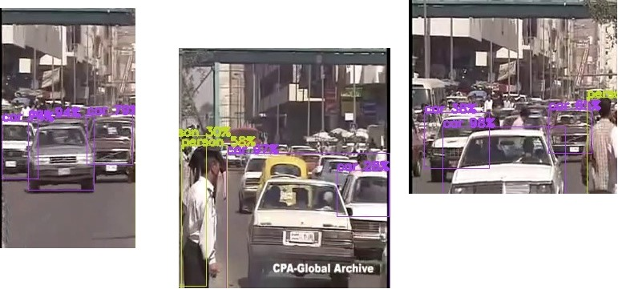

# Object-Detection




## Definition

This project is object detection using MobileNetSSD model.

#### This project based on this [tutorial](https://www.pyimagesearch.com/2017/09/11/object-detection-with-deep-learning-and-opencv/)


## Description

The classes that the model can classiy and detect are 21 classes ["background", "aeroplane", "bicycle", "bird", "boat",
	"bottle", "bus", "car", "cat", "chair", "cow", "diningtable","dog", "horse", "motorbike", "person", "pottedplant", "sheep",
	"sofa", "train", "tvmonitor"].

### Dependencies

#### install this libraries:
- numpy
- OpenCV

#### Download any video you want to classify and put it in the directory that contain the project and change this line according to the name of your video then run the code.

```html
cap = cv2.VideoCapture("test_video.mp4")
```
